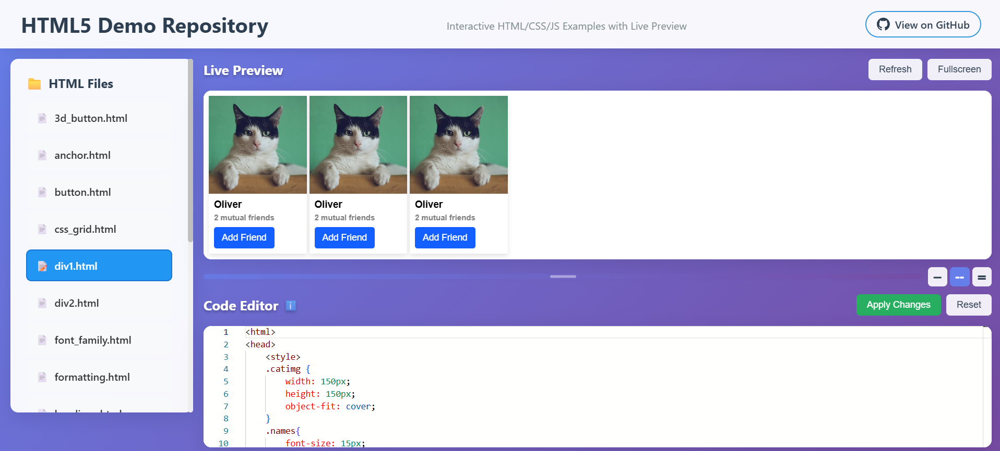

# 🚀 HTML5 Demo Repository

Welcome to the **HTML5 Demo Repository** - an interactive showcase of HTML, CSS, and JavaScript examples!



## 🌐 Live Interactive Demo

**🎯 [Visit the Live Demo Website](https://rishabharaj.github.io/HTML5/demo-site/)**

Experience all the HTML examples with:
- **📝 Live Code Editor** with syntax highlighting
- **👁️ Real-time Preview** - see changes instantly
- **📁 File Browser** - navigate through all examples
- **📱 Responsive Design** - works on all devices

---

## ✨ Features

- **Interactive Code Editor**: Edit HTML/CSS/JS code using Monaco Editor
- **Live Preview**: See your changes in real-time as you type
- **File Browser**: Easy navigation through all HTML examples  
- **Responsive Design**: Perfect on desktop and mobile
- **GitHub Pages**: Automatically deployed and updated

## 🛠️ HTML Examples Included

- **3d_button.html** - CSS 3D button effects
- **anchor.html** - HTML anchor tags and navigation
- **button.html** - Various button styles and interactions
- **css_grid.html** - CSS Grid layout examples
- **div1.html & div2.html** - Div element usage
- **font_family.html** - Font styling demonstrations
- **formatting.html** - Text formatting examples
- **headings.html** - HTML heading hierarchy
- **img.html** - Image handling and optimization
- **inline_alignment.html** - Text and element alignment
- **List.html** - HTML lists (ordered, unordered)
- **mail.html** - Email-related HTML patterns
- **psudo_classes.html** - CSS pseudo-classes
- **table.html** - HTML table structures
- **text.html & text2.html** - Text styling and typography

## 🕹️ How to Use

1. **[Visit the Live Demo](https://rishabharaj.github.io/HTML5/demo-site/)**
2. Select any HTML file from the sidebar
3. View the live preview in the demo area
4. Edit the code in the editor below
5. See your changes reflected immediately
6. Use keyboard shortcuts:
   - `Ctrl/Cmd + S`: Apply changes
   - `Ctrl/Cmd + R`: Refresh preview
   - `Ctrl/Cmd + Shift + Z`: Reset to original

## 💻 Local Development

```bash
# Clone the repository
git clone https://github.com/rishabharaj/HTML5.git
cd HTML5

# Serve locally (choose one)
python -m http.server 8000
# or
npx serve .

# Visit http://localhost:8000/demo-site/
```

## 🌟 Technologies Used

- **HTML5** - Modern semantic markup
- **CSS3** - Grid, Flexbox, animations
- **JavaScript (ES6+)** - Interactive functionality  
- **Monaco Editor** - Professional code editor
- **GitHub Pages** - Automatic deployment

---

> **🎯 Perfect for learning, experimenting, and showcasing HTML5 concepts!**

### Made with ❤️ & curiosity by [rishabharaj](https://github.com/rishabharaj)
